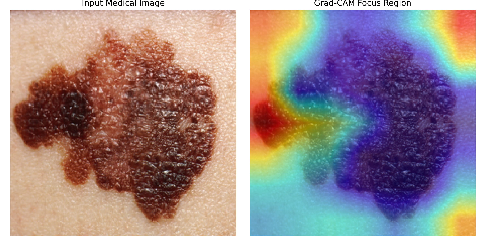

# 🔬 Explainable Skin Lesion Classifier using PyTorch & Grad-CAM

A medical computer vision pipeline built with PyTorch that analyzes dermoscopic skin lesion images and uses **Grad-CAM (Gradient-weighted Class Activation Mapping)** to highlight diagnostic decision regions for explainable AI.

---

## 🎯 Explainability Results

Below is the side-by-side comparison showing the original dermoscopic scan and the generated Grad-CAM heatmap highlighting high-activation decision regions:



---

## 🛠️ Tech Stack & Methods

* **Framework:** PyTorch & Torchvision
* **Architecture:** EfficientNet-B0 (adapted for multi-class lesion classification)
* **Explainability:** `pytorch-grad-cam` layer activation hooks
* **Image Processing:** OpenCV, PIL, NumPy, Matplotlib

---

## 🚀 Quick Start

### 1. Clone the Repository
```bash
git clone [https://github.com/cyberpunk92/skin-lesion-gradcam-pytorch.git](https://github.com/cyberpunk92/skin-lesion-gradcam-pytorch.git)
cd skin-lesion-gradcam-pytorch
```
